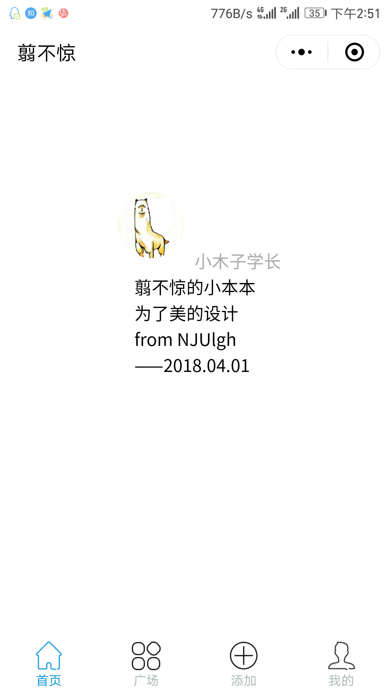
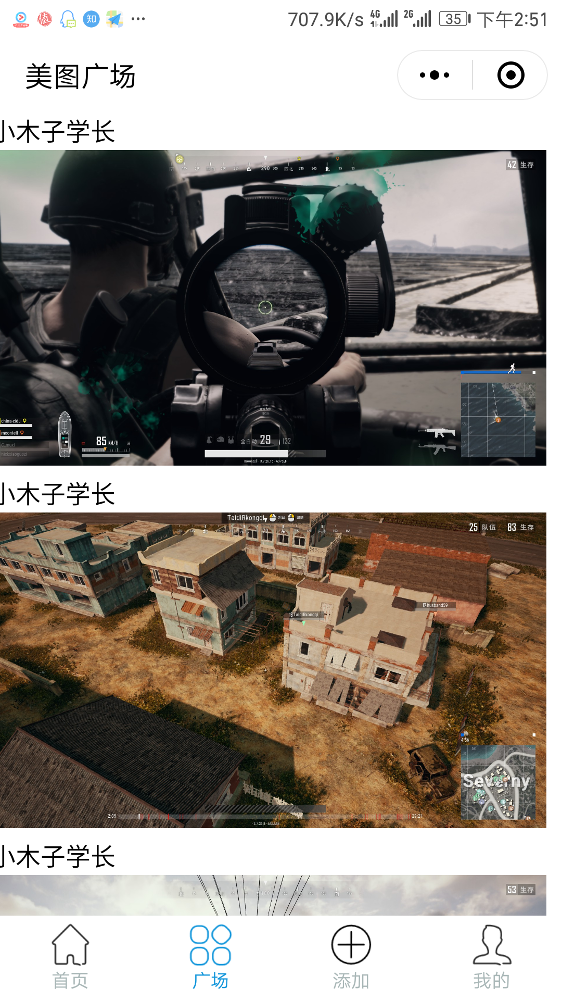
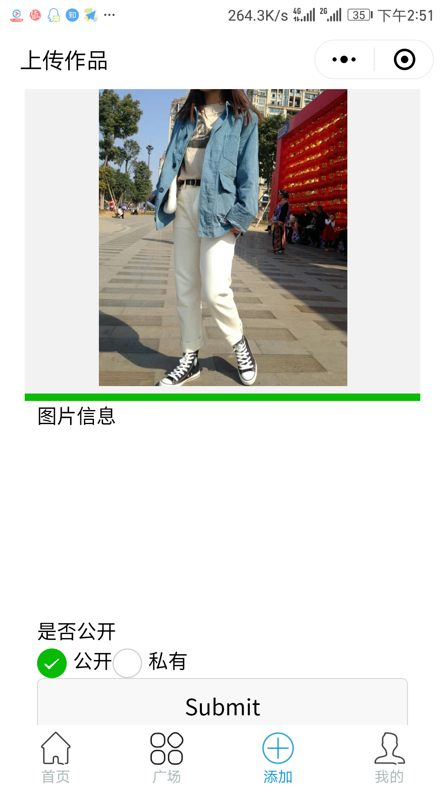
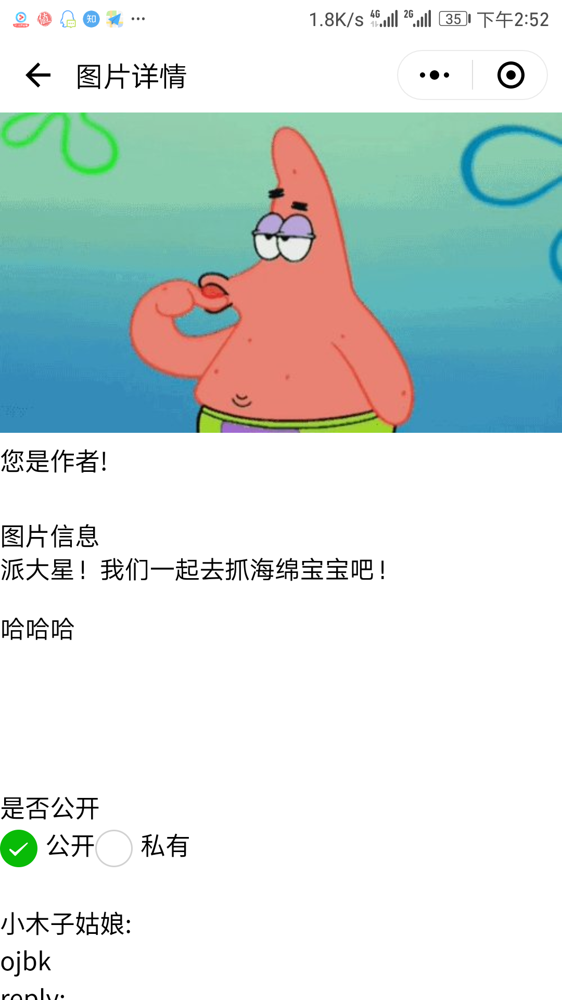

#翦不惊的小本本 小程序后端

##小程序对后端的要求
首先要在微信公众平台中增加requesturl，小程序只能访问指定的域名下的api   
其次，必须使用https来调用api，所以本springboot项目必须进行ssl的配置  

另外，由于小程序本身对代码和静态资源大小的限制，静态资源（主要是图片）需要找到合适的存储方式。这里选择了七牛云的免费10G对象存储。由于七牛云对上传时的安全策略，需要获取一个uptoken。本项目的QiniuService中有获取uptoken的api    

##springboot ssl配置
使用了腾讯云的免费ssl证书   
将文件夹中用于tomcat的证书复制到`main/resources`文件夹下   
`server.port= 443`   
`server.ssl.key-store= classpath:jianbujing.moontell.cn.jks`   
`server.ssl.key-store-password=123456`  
`server.ssl.keyStoreType= PKCS12`  
`server.ssl.keyAlias= jianbujing.moontell.cn`  
注意：比较坑的是，使用jdk8来执行打包好的jar包会报错，必须使用jdk9！重要的事一定要注意！  

下面的自建ssl证书被证明无用   
`keytool -genkey -alias jianbujing  -storetype PKCS12 -keyalg RSA -keysize 2048  -keystore keystore.p12`   
创建名为`keystore.p12`的密钥库，并将它移动到`main/resources`下。  

application.properties如下   
`server.port= 8443`  
`server.ssl.key-store= classpath:keystore.p12`  
`server.ssl.key-store-password= 123456`  
`server.ssl.keyStoreType= PKCS12`   
`server.ssl.keyAlias= jianbujing`   

##开发和版本控制说明
- 使用微信web开发工具，项目目录选择本git项目中`jianbujing_xiaochengxu`模块所在的文件夹，这是微信web开发工具会自动的显示appid和项目名称
- 开发及测试使用本地运行提供的api。因为小程序前端使用的api域名为`https://jianbujing.moontell.cn`。需要开发人员覆盖本地的hosts文件，具体操作是为了产生`127.0.0.1 jianbujing.moontell.cn`的映射，将后端项目根目录下的hosts文件复制到`C:\Windows\System32\drivers\etc`文件下，linux、mac和其他windows版本的hosts文件地址会不同。    
- 版本控制：使用idea内置的git管理   
- 应该经常备份数据库！

##小程序截图

