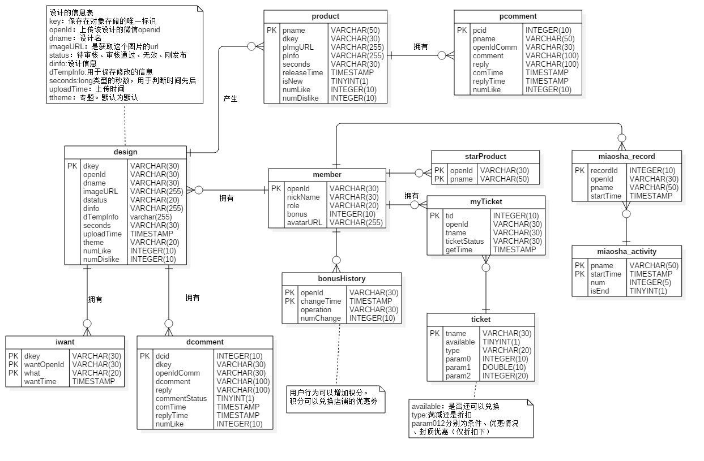

# 南雍记 小程序

## 项目背景

南京大学某校内文化创意创业团队，定位于南京大学相关文化创意产品的设计、推广和销售。

目前阶段存在的增长约束有如下几点： 目前阶段存在的增长约束有如下几点：

1. 不能高效的开展营销活动，微信公众号和淘宝店铺无法有作为流量入口以开展营销。
2. 因为校园氛围的存在，不能内做硬性广告和宣传否则易引起同学客户群体反感。
3. 无法培养用户群的稳定和粘性，核心师生体缺乏对南雍文创长期关注。
4. 客户群狭小，主要面对南大师生。
5. 学生精力有限，客服和设计师团队压较大。

## 识别项目功能需求

开发一款小程序的目的主要用于解决“增长约束”的 1、2、3 点。如果试图用一句话重新描述这三点，我觉得如下比较合适：

因为缺乏自有独立的小平台，供团队发布新设计、获取粉丝意见、粉丝交流、加深与粉丝关系、宣传新产品、运营营销活动、推动粉丝向他人分享南雍文创、让粉丝更加了解南雍文创，南雍文创难以获得客户长期的关注、难以发布促销活动、无法发布“广告味轻”的广告，并且现有微信公众号功能不够定制化、缺乏粉丝间进行交流的有效手段如 qq 群，因此需要一个开发一个自己的平台，集成客户交流、广告宣传、活动与营销功能于一体，并为用户提供方便快捷的入口。

下面将这句话分点描述以说明该平台应有的特点和功能。

1. 设计师可以将自己的设计发布到该平台，以此吸引用户关注、获取用户意见和拓展与用户之间的交流。宣传美，交流美相信也是一种软性的广告。
2. 用户可以分享本平台的内容到平台外部比如微信和qq等。分享是扩大用户群的一个很重要手段，也是微信公众号和淘宝无法直接实现的功能。
3. 用户可以发布自己的设计，永久在平台展示，用户间可以交流对设计的看法，并对上传设计的用户进行奖励，如开设票选最佳设计和甄选设计孵化为产品等。这能增进与用户关系，将原本封闭的团队变为一个开放的状态。
4. 管理员可以审核用户上传的设计。
5. 团队发布产品前，可以在平台发布新品预告，以此宣传宣传新品来达到广告的作用， 预告同时在培养用户期待的心理。
6. 团队可以发布一些营销活动，简单的促销活动如分享预告新品到朋友圈点赞，凭截图可以 9 折购买，点赞数最多送产品等。这里的营销活动，就是最直接的营销活动。无需隐藏商业气息。
7. 便捷的入口和集成的功能。便捷的入口：如果用户要下载一个 app 或者手输网址才能使用平台则太不方便。功能集成：需要一个平台满足所有的功能。为此我想到的最佳平台是：微信小程序。

## 项目业务需求

1. BR1: 项目上线一个月，平台活动用户数达到300人
2. BR2: 项目上线三个月，团队淘宝店销售额翻两番，利润翻翻一番
3. BR3: 项目上线半年 40%的用户产生了再次购买行为
4. BR4: 项目上线一年，有 500的用户是长期用户。

## 项目技术开发方案

技术选择： 使用springboot和mybatis搭建后端。按需加入redis、消息中间件、数据库读写分离、负载均衡等技术

迭代式开发设计：

- 迭代一：
    1. 实现团队设计师设计的上传和列表展示
    2. 实现单个设计的详情展示，并提供相关的操作选项（我想要、不喜欢、收藏、评论）
    3. 实现个人中心
- 迭代二：
    1. 实现新品预告功能。平台管理员可以发布新品预告。
    2. 完善营销活动发布、参与、结果展示等流程
    3. 在2的基础上可以发布和管理与新品相关的活动
    4. 在2的基础上，设计一系列日常营销活动（评论点赞数、设计专题发布、积分兑换）。
- 迭代三：
    1. 实现用户上传设计、管理员审核设计功能
    2. 实现用户查看用户所上传的设计（查看全部、查看专题、查看最热、查看最新、随机等）
    3. 用户可以推荐用户设计孵化为文创产品。

## 时间线：

以下时间节点皆为deadline

- 4.22 完成迭代一的原型图设计和评审
- 4.22 完成后端环境的搭建，实现可可预料的api如获取用户openid
- 4.25 完成数据库表的全部设计
- 5.3 迭代一完成
- 5.5 完成迭代二原型图设计和评审
- 5.6 评估迭代一的数据库设计，进行修改
- 5.15 迭代二完成
- 5.17 完成迭代三原型图的设计和评审
- 5.18 评估迭代二修改后的数据库设计，进行修改
- 5.30 完成迭代三
- 6.8 优化——负载均衡、redis、消息队列等；完善文档
- 6.9 最后检查，提交作品

## 小程序对后端的要求

首先要在微信公众平台中增加requesturl，小程序只能访问指定的域名下的api

其次，必须使用https来调用api，所以本springboot项目必须进行ssl的配置

另外，由于小程序本身对代码和静态资源大小的限制，静态资源（主要是图片）需要找到合适的存储方式。这里选择了七牛云的免费10G对象存储。由于七牛云对上传时的安全策略，需要获取一个uptoken。本项目的QiniuService中有获取uptoken的api

## 小程序发送模板消息

模板消息用来向用户发送通知

关于access_token:

access_token 是全局唯一接口调用凭据，开发者调用各接口时都需使用 access_token

接口地址：
https://api.weixin.qq.com/cgi-bin/token?grant_type=client_credential&appid=APPID&secret=APPSECRET

access_token目前两个小时就会失效，使用失效的access_token会有`{"errcode": 
40001, "errmsg": "invalid credential, access_token is invalid or not latest hint: [7c2Oya0303vr61!]"}`

对此后端中定时每两个小时执行以此更新access_code的任务。

前端需要使用如下代码获得access_code

```js
//从后端获取access_token
var that=this
wx.request({
   url: 'https://jianbujing.moontell.cn/api/weixin/accesstoken',
   success: function (res) {
   that.data.accessToken = res.data.access_token;
   console.log("设置access_token: ", that.data.accessToken);
   }
})
```

## springboot ssl配置

使用了腾讯云的免费ssl证书

将文件夹中用于tomcat的证书复制到`main/resources`文件夹下

```
server.port= 443
server.ssl.key-store= classpath:nywc.moontell.cn.jks
server.ssl.key-store-password=123456
server.ssl.keyStoreType= PKCS12
server.ssl.keyAlias= nywc.moontell.cn
```
注意：比较坑的是，使用jdk8来执行打包好的jar包会报错，必须使用jdk9！重要的事一定要注意！

下面的自建ssl证书被证明无用

`keytool -genkey -alias jianbujing  -storetype PKCS12 -keyalg RSA -keysize 2048  -keystore keystore.p12`

创建名为`keystore.p12`的密钥库，并将它移动到`main/resources`下。

application.properties如下

```
server.port= 8443
server.ssl.key-store= classpath:keystore.p12
server.ssl.key-store-password= 123456
server.ssl.keyStoreType= PKCS12
server.ssl.keyAlias= jianbujing
```

## MyBatis Generator 使用

MyBatis Generator可以自动的生成mapper.xml;dao的接口和POJO。

使用方法如下：

在`pom.xml`中的`plugin`中增加：

```xml
            <plugin>
                <groupId>org.mybatis.generator</groupId>
                <artifactId>mybatis-generator-maven-plugin</artifactId>
                <version>1.3.2</version>
                <configuration>
                    <verbose>true</verbose>
                    <overwrite>true</overwrite>
                </configuration>
            </plugin>
```

在resources下新建`generatorConfig.xml`，内容如下
```xml
<?xml version="1.0" encoding="UTF-8" ?>
<!DOCTYPE generatorConfiguration PUBLIC "-//mybatis.org//DTD MyBatis Generator Configuration 1.0//EN" "http://mybatis.org/dtd/mybatis-generator-config_1_0.dtd" >
<generatorConfiguration>
    <classPathEntry
            location="D:\jar\mysql-connector-java-5.1.46.jar" />
    <context id="context1" targetRuntime="MyBatis3">
        <commentGenerator>
            <!-- 是否去除自动生成的注释 true：是 ： false:否 -->
            <property name="suppressAllComments" value="true" />
        </commentGenerator>

        <jdbcConnection driverClass="com.mysql.jdbc.Driver"
                        connectionURL="jdbc:mysql://mysql.moontell.cn:3306/nywc"
                        userId="nywc" password="nywcbynju15125" />
        <javaModelGenerator targetPackage="com.arloor.nywc.domain"
                            targetProject="src/main/java" />

        <sqlMapGenerator targetPackage="mapper"
                         targetProject="src/main/resources" />

        <javaClientGenerator type="XMLMAPPER" targetPackage="com.arloor.nywc.dao"
                          targetProject="src/main/java">
        </javaClientGenerator>

        <table tableName="design" domainObjectName="Design"
            enableCountByExample="false" enableUpdateByExample="false" enableDeleteByExample="false"
            enableSelectByExample="false" selectByExampleQueryId="false" >
            <property name="useActualColumnNames" value="true"/>
        </table>
        <table tableName="bonusHistory" domainObjectName="BonusHistory"
               enableCountByExample="false" enableUpdateByExample="false" enableDeleteByExample="false"
               enableSelectByExample="false" selectByExampleQueryId="false" >
            <property name="useActualColumnNames" value="true"/>
        </table>
        <table tableName="dcomment" domainObjectName="DComment"
               enableCountByExample="false" enableUpdateByExample="false" enableDeleteByExample="false"
               enableSelectByExample="false" selectByExampleQueryId="false" >
            <property name="useActualColumnNames" value="true"/>
        </table>
        <table tableName="iwant" domainObjectName="IWant"
               enableCountByExample="false" enableUpdateByExample="false" enableDeleteByExample="false"
               enableSelectByExample="false" selectByExampleQueryId="false" >
            <property name="useActualColumnNames" value="true"/>
        </table>
        <table tableName="member" domainObjectName="Member"
               enableCountByExample="false" enableUpdateByExample="false" enableDeleteByExample="false"
               enableSelectByExample="false" selectByExampleQueryId="false" >
            <property name="useActualColumnNames" value="true"/>
        </table>
        <table tableName="myTicket" domainObjectName="MyTicket"
               enableCountByExample="false" enableUpdateByExample="false" enableDeleteByExample="false"
               enableSelectByExample="false" selectByExampleQueryId="false" >
            <property name="useActualColumnNames" value="true"/>
        </table>
        <table tableName="pcomment" domainObjectName="PComment"
               enableCountByExample="false" enableUpdateByExample="false" enableDeleteByExample="false"
               enableSelectByExample="false" selectByExampleQueryId="false" >
            <property name="useActualColumnNames" value="true"/>
        </table>
        <table tableName="product" domainObjectName="Product"
               enableCountByExample="false" enableUpdateByExample="false" enableDeleteByExample="false"
               enableSelectByExample="false" selectByExampleQueryId="false" >
            <property name="useActualColumnNames" value="true"/>
        </table>
        <table tableName="starProduct" domainObjectName="StarProduct"
               enableCountByExample="false" enableUpdateByExample="false" enableDeleteByExample="false"
               enableSelectByExample="false" selectByExampleQueryId="false" >
            <property name="useActualColumnNames" value="true"/>
        </table>
        <table tableName="ticket" domainObjectName="Ticket"
               enableCountByExample="false" enableUpdateByExample="false" enableDeleteByExample="false"
               enableSelectByExample="false" selectByExampleQueryId="false" >
            <property name="useActualColumnNames" value="true"/>
        </table>
    </context>
</generatorConfiguration>
```

## 运维要求

基本没有

- 使用的`nywc.moontell.cn`服务器的续费
- `nywc.moontell.cn` ssl证书的一年一次的续费
- 关注七牛云方面的变化
- 数据库服务器维护
- 可执行jar包的保存
- 一定要使用jdk9 

## ER图



## springboot打包为war

pom.xml

```xml
        <!--war打包方式-->
        <dependency>
            <groupId>org.springframework.boot</groupId>
            <artifactId>spring-boot-starter-tomcat</artifactId>
            <scope>provided</scope>
        </dependency>
```

```xml
    <!--war打包方式-->
    <packaging>war</packaging>
```

主类配置

```java
	@SpringBootApplication
    @EnableTransactionManagement
    public class NYWCApplication extends SpringBootServletInitializer {
    
    	/**
    	 * 用于war打包
    	 * @param application
    	 * @return
    	 */
    	@Override
    	protected SpringApplicationBuilder configure(SpringApplicationBuilder application) {
    		return application.sources(NYWCApplication.class);
    	}
    
    	public static void main(String[] args) {
    		ApplicationContext app=SpringApplication.run(NYWCApplication.class, args);
    	}
    }
```


## 秒杀系统设计

## 秒杀开始问题

使用quartz定时（例如8：00）初始化秒杀开始环境。

秒杀开始环境是什么？

- 客户端视角判断开始：在cdn上放置某一文件或者将文件设置成符合要求。
- 后端视角判断开始：将某一计数变量n由0设为1000。并且将数据库（硬盘）中的数据缓存/映射到内存中（redis或者普通容器）


## 秒杀请求处理 ——逐级降低流量

前端怎么降低暂且不考虑。先考虑真实请求到api的请求。

上面说的计数变量n是允许进行处理的请求数量，每到达一个请求，n减一。n为0时，不再允许新的请求，也就是接口直接返回秒杀失败。这一处理导致只有n个请求真正被处理。

现在有最多n个请求需要处理。下一步：使用有界阻塞队列。这n个请求都尝试加入有界阻塞队列。加入成功，进行下一步处理。加入超时（使用blockqueue的offer方法）则返回秒杀失败。

现在n中又只有一小部分m存活下来，加入了要被处理的队列。

现在就是一个生产者消费者的问题。现在有a个消费者来处理这m个请求。消费者拿着请求去修改内存中货物的缓存/映射。

修改成功，则设置标志表示某位用户秒杀成功，并且减少库存/货物。当减到0时，设置秒杀结束的标志。

## 客户端获取秒杀结果

在网上看到的都是说客户端去轮询秒杀结果。就这样做吧。

上面m个请求真正会被消费者处理。这m个请求者会轮询一个接口，接口返回秒杀成功/秒杀已结束。

## 秒杀结果持久化

上面秒杀请求的处理最终只停留在内存数据的修改上。

下面要将秒杀结果持久化到数据库。

这样考虑，如果有一百件货物，也就是有一百个请求成功，一百个需要数据持久化。最糟糕的情况是：开一百个数据库连接进行处理。我不知道100这个数量对数据库意味着什么，反正觉得不合理，不合理的另外一方面是100个事务的竞争还是挺大的。

解决方案：异步+生产者消费者。异步要么使用消息队列要么还是blockqueue。b个消费者负责数据持久化。b将100个数据库连接减少到一个可以接受的量级。

## 秒杀实现

请看`com.arloor.nywc.miaoshatools`包下的代码。秒杀请求由`/api/miaosha/requestmiaosha`接收
